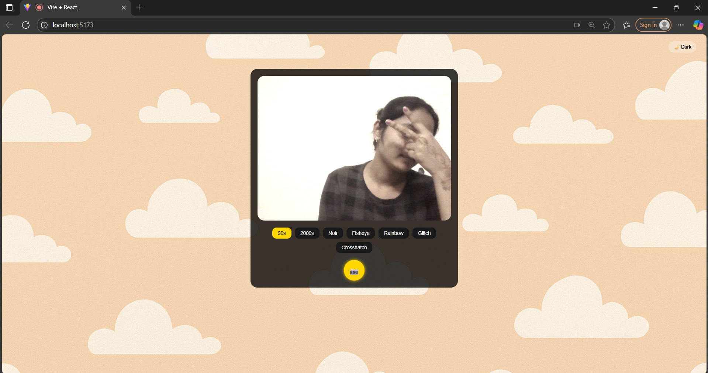
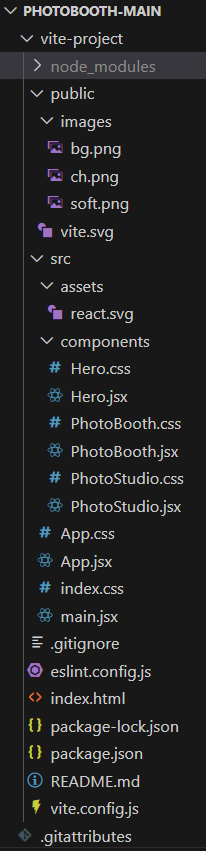
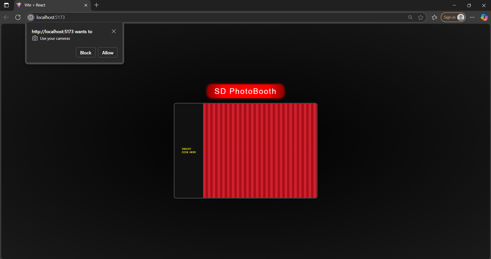

# DV PhotoBooth 🎞️

## 🎯 Final Output - UI Preview
Below is a screenshot of the app interface:



DV PhotoBooth 🎞️ is a fun and interactive virtual photo booth built with React and Vite.  
Simulates a retro-style booth with coin insert, curtains, webcam feed, filters, and downloadable photo strips.

## 📚 Table of Contents
- [Features](#features)
- [Tech Stack](#tech-stack)
- [Demo](#demo)
- [Getting Started](#getting-started)
- [Project Structure](#project-structure)
- [Screenshots](#screenshots)
- [Author](#author)

## ✨ Features
- Coin insert animation & curtain reveal
- Real-time webcam with countdown
- Classic photo filters: 90s, 2000s, Noir, Rainbow, Glitch, and more
- Theme toggle: Light 🌞 / Dark 🌚
- Capture photos into stylish vertical photo strips
- Download strip as image (e.g., SD_strip_YYYY-MM-DD.jpg)

## 🛠️ Tech Stack
- ⚡ Vite
- ⚛️ React
- 📸 react-webcam
- 🎨 CSS (custom + animations)
- 📦 html2canvas
- 🎥 framer-motion

## 🔗 Demo
[Live Demo Link](#) <!-- Optional: Add when deployed -->

## 🚀 Getting Started

### Prerequisites
- Node.js and npm installed

### Installation

1. Clone the repo:
```bash
git clone https://github.com/your-username/dv-photobooth.git
cd dv-photobooth
```

2. Install dependencies since the node modules is excluded in this repository:
```bash
npm install
```

3. Run the app locally:
```bash
npm run dev
```

Then open your browser to `http://localhost:5173/`.

## 🗂️ Project Structure

```
📁 dv-photobooth  
├── 📁 assets  
├── 📁 src  
│   ├── 📄 PhotoBooth.jsx  
│   ├── 📄 PhotoStudio.jsx  
│   ├── 📄 PhotoBooth.css  
│   └── 📄 PhotoStudio.css  
├── 📄 index.html  
├── 📄 package.json  
└── 📄 vite.config.js
```

🖼️ Screenshot:


## 🖼️ Screenshots

### Home (Before Coin Insert)


### Downloaded Strip Preview
.jpg)

## 👩‍💻 Author

- Swathi Gurijala  
- [LinkedIn](https://www.linkedin.com/in/swathi-gurijala)  
- 4th-year AIML, Malla Reddy University
